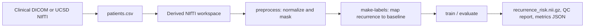
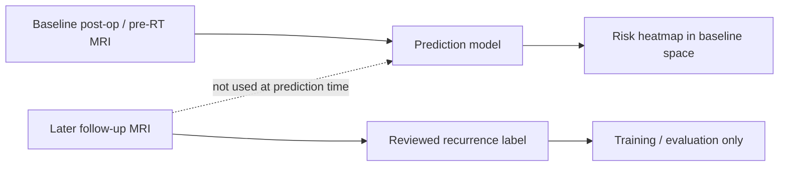
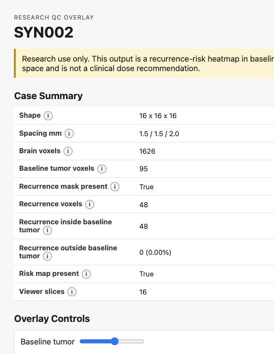
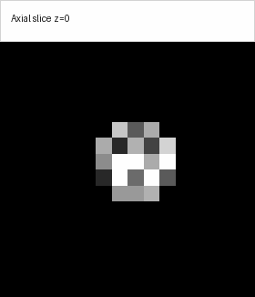

# Glioma Recurrence Risk Pipeline

[](https://www.python.org/)
[](https://docs.astral.sh/uv/)
[](LICENSE)
[](#research-use)
[](https://www.cancerimagingarchive.net/collection/ucsd-ptgbm/)

This repository builds a retrospective research pipeline for predicting where glioma may recur after surgery. It uses post-operative, pre-radiotherapy MRI as the baseline, maps later reviewed recurrence labels back into that baseline space, and produces a voxelwise `recurrence_risk.nii.gz` heatmap plus a human-readable QC report.

The public-data path is MRI-only and uses longitudinal NIfTI images and tumor segmentations. The intended institutional path starts from clinical DICOM, converts to NIfTI for research processing, and later exports stable research outputs back to DICOM.

| Question | V1 answer |
| --- | --- |
| Baseline input | Post-op/pre-RT T1c + FLAIR MRI, plus baseline tumor mask |
| Training label | Later clinician-reviewed recurrence mask mapped to baseline space |
| Output | Baseline-space voxelwise recurrence-risk heatmap |
| Current datasets | UCSD-PTGBM for public engineering; institutional DICOM cohort planned |
| Status | Research prototype |

## Project Shape



The key safety rule is simple: follow-up scans help define labels, but they are never prediction-time model inputs.



## Try It Without Medical Data

This smoke test creates a tiny fake dataset, runs the full MRI-only path, writes metrics, and opens the same QC machinery used for real cases. The fake images are only for checking that the software works.

```sh
git clone https://github.com/danhussey/brain-cancer-recurrence.git
cd brain-cancer-recurrence
uv sync --extra dev

uv run python scripts/generate_synthetic_dataset.py --output-root /tmp/glioma-smoke --n-patients 3 --shape 16,16,16
uv run glioma-risk preprocess --manifest /tmp/glioma-smoke/patients.csv --derived-root /tmp/glioma-smoke/derived
uv run glioma-risk make-labels --manifest /tmp/glioma-smoke/patients.csv --derived-root /tmp/glioma-smoke/derived --assume-baseline-space
uv run glioma-risk train --manifest /tmp/glioma-smoke/patients.csv --derived-root /tmp/glioma-smoke/derived --model tumor-distance --output /tmp/glioma-smoke/models/tumor-distance.json
uv run glioma-risk evaluate --manifest /tmp/glioma-smoke/patients.csv --derived-root /tmp/glioma-smoke/derived --model-path /tmp/glioma-smoke/models/tumor-distance.json --output /tmp/glioma-smoke/reports/eval.json --splits validation,test --write-predictions
uv run glioma-risk predict --case-dir /tmp/glioma-smoke/derived/SYN002 --model-path /tmp/glioma-smoke/models/tumor-distance.json --output-dir /tmp/glioma-smoke/derived/SYN002
```

Open `/tmp/glioma-smoke/derived/SYN002/qc_overlay.html` after the run.

## QC Report

The QC report is a static HTML file written beside each case. It includes a case summary, tooltip explanations, opacity controls, an axial slice browser, and overlays for baseline tumor, recurrence label, and model risk.



The slice browser is deliberately simple: it is filesystem-friendly, works without a server, and lets reviewers move through the volume quickly.



Reports also write `qc_summary.json`, which includes recurrence voxels inside and outside the baseline tumor mask. That distinction matters because residual tumor is expected to be high risk; the harder scientific question is whether a model can predict marginal or distant recurrence outside the obvious baseline tumor footprint.

## Running The Pipeline

Base install includes the MRI pipeline, NIfTI IO, SimpleITK registration, QC reports, baseline models, and tests.

```sh
uv sync --extra dev
```

Optional MONAI/PyTorch U-Net support is behind the `deep` extra.

```sh
uv sync --extra dev --extra deep
```

Common CLI stages:

```sh
glioma-risk dicom-audit --dicom-root clinical-dicom --output reports/dicom-series.csv --summary-output reports/dicom-summary.json
glioma-risk preprocess --manifest patients.csv --derived-root derived
glioma-risk make-labels --manifest patients.csv --derived-root derived
glioma-risk train --manifest patients.csv --derived-root derived --model tumor-distance --output models/tumor-distance.json
glioma-risk train --manifest patients.csv --derived-root derived --model voxel-logistic-mri --output models/voxel-logistic-mri.json
glioma-risk evaluate --manifest patients.csv --derived-root derived --model-path models/voxel-logistic-mri.json --output reports/eval.json
glioma-risk predict --case-dir derived/P001 --model-path models/voxel-logistic-mri.json --output-dir derived/P001
```

| Model | Role |
| --- | --- |
| `tumor-distance` | Required simple baseline. A learned model should beat this before it is scientifically interesting. |
| `voxel-logistic-mri` | First learned MRI-only baseline using T1c, FLAIR, baseline tumor mask, and distance features. |
| `unet` | Optional MONAI/PyTorch 3D U-Net path when the `deep` extra is installed. |

The default `make-labels` path uses SimpleITK MRI-to-MRI registration. Use `--registration-mode affine` or `--assume-baseline-space` only when the geometry fallback has been checked.

## Data Workflows

For institutional data, start with a read-only DICOM inventory before conversion:

```sh
uv run glioma-risk dicom-audit \
  --dicom-root /Volumes/External/clinical-dicom \
  --output /Volumes/External/intake/reports/dicom-series.csv \
  --summary-output /Volumes/External/intake/reports/dicom-summary.json
```

The audit reads headers only. It hashes patient keys by default, omits source file paths unless explicitly requested, classifies likely T1/T1c/T2/FLAIR series, summarizes scanner metadata, and flags common PHI-bearing fields.

For UCSD-PTGBM, download images, segmentations, and clinical tables from TCIA onto external storage, then prepare a copied workspace:

```sh
uv run python scripts/prepare_ucsd_ptgbm_dataset.py \
  --source-root /Volumes/External/UCSD-PTGBM \
  --clinical-table /Volumes/External/UCSD-PTGBM/clinical.xlsx \
  --negative-cases-table /Volumes/External/UCSD-PTGBM/details_of_negative_cases_TCIA.xlsx \
  --include-negative-controls \
  --output-root /Volumes/External/UCSD-PTGBM-pipeline
```

The adapter selects subjects with at least two complete MRI+mask timepoints, uses the earliest complete post-treatment timepoint as baseline, and uses the earliest later residual/recurrent tumor timepoint as the recurrence label. Negative-case tables can keep pseudoprogression, radiation-necrosis, and non-specific later timepoints as controls with empty recurrence labels.

## Research Use

This is a retrospective research and engineering prototype, not a medical device. The risk map is not a clinical dose recommendation, and it should not be used for clinical decision-making, treatment planning, radiotherapy dose design, boost-region selection, or patient management.

The current acceptance bar is intentionally conservative: a learned model should beat the `tumor-distance` baseline under patient-level validation before it is treated as scientifically interesting.

## Reference

### Manifest Columns

Required columns:

| Column | Meaning |
| --- | --- |
| `patient_id` | Patient/case identifier. Splits are enforced at this level. |
| `baseline_scan_date` | Baseline post-op/pre-RT scan date. |
| `baseline_t1c_series_uid` | Baseline T1 post-contrast series UID or NIfTI path in prepared workflows. |
| `baseline_flair_series_uid` | Baseline FLAIR series UID or NIfTI path in prepared workflows. |
| `recurrence_scan_date` | Follow-up scan date used for recurrence label context. |
| `recurrence_adjudication` | Clinical recurrence/progression decision. |
| `reviewed_recurrence_mask_path` | Reviewed recurrence mask path, or an empty label path for controls. |
| `split` | `train`, `validation`, `test`, or `holdout`. |

Recommended optional columns include `reviewed_recurrence_reference_image_path`, `source_dataset`, `baseline_timepoint_id`, `recurrence_timepoint_id`, `radiotherapy_end_date`, `baseline_study_instance_uid`, `baseline_t1_series_uid`, `baseline_t2_series_uid`, `input_format`, `institution_id`, `scanner_manufacturer`, `scanner_model`, `magnetic_field_strength`, and `label_source`.

### Derived Case Files

Each case directory stores these files:

```text
baseline_t1c.nii.gz
baseline_flair.nii.gz
baseline_tumor_mask.nii.gz
recurrence_mask_on_baseline.nii.gz
brain_mask.nii.gz
recurrence_risk.nii.gz
qc_overlay.html
qc_summary.json
```

### Observability Artifacts

Every CLI stage writes structured run artifacts unless `--no-observability` is passed.

| File | Contents |
| --- | --- |
| `events.jsonl` | Timestamped stage, case, metric, and artifact events. |
| `summary.json` | Final status, duration, case statuses, command args, and output artifacts. |

For manifest stages, artifacts default to `DERIVED_ROOT/../observability/RUN_ID/`. For `predict`, they default beside the output directory.

### Development Checks

```sh
uv run --extra dev pytest
uv run --extra dev python scripts/validate_knowledge_store.py
```

## Data Safety

The repository should not contain patient data, clinical spreadsheets, private credentials, or local derived outputs. Keep real datasets on external storage or institution-approved systems. If working data is written inside the repo, note that `.gitignore` currently covers `derived/`, `models/`, and `reports/`, but not sibling directories such as `masks/`, `label_refs/`, or `observability/`.

## Glossary

| Term | Meaning |
| --- | --- |
| Affine | Matrix that maps voxel indices to real patient/world coordinates. |
| AUPRC | Area under the precision-recall curve; useful when recurrence voxels are rare. |
| Baseline / t0 | Earlier post-treatment MRI timepoint used as prediction input. |
| Baseline tumor mask | Tumor segmentation at the baseline timepoint. This is a prediction-time location feature. |
| Brain mask | Binary mask limiting training/evaluation to brain voxels. |
| Brier score | Mean squared error of predicted probabilities; lower is better. |
| Calibration | Whether predicted risks match observed recurrence frequencies. |
| Confirmed recurrence label | Reviewed decision that a later abnormality is true recurrent/progressive tumor plus a voxelwise mask of that tumor. |
| DICOM | Clinical imaging file format used by scanners, PACS, and radiotherapy systems. |
| DICOM SEG | DICOM segmentation object type suitable for future binary or multi-label mask exports. |
| Dice | Spatial overlap score between a predicted region and a label mask. |
| FLAIR | MRI sequence that highlights edema and abnormal fluid-like tissue signal. |
| Follow-up / t1 / t2 | Later imaging timepoints used to determine whether and where recurrence happened. |
| GBM | Glioblastoma, an aggressive glioma. |
| Glioma | Brain tumor type arising from glial cells. |
| Leakage | Accidental sharing of the same patient across train/validation/test. |
| NIfTI | Common research imaging file format, usually `.nii` or `.nii.gz`. |
| Parametric Map | DICOM object type suitable for voxelwise quantitative maps such as future risk-map exports. |
| Pseudoprogression | Early post-radiotherapy imaging change that can mimic recurrence. |
| QC overlay | Visual report showing anatomy, masks, and prediction for human review. |
| Recurrence mask | Human-reviewed mask of where tumor recurrence later occurred, mapped back to baseline space. |
| Registration | Aligning images from different scans into the same coordinate space. |
| Resampling | Regridding one image onto another image's voxel grid after alignment. |
| Risk heatmap | Voxelwise model output from 0 to 1 estimating recurrence risk. |
| Split | Train, validation, or test assignment at the patient level. |
| T1c / T1gd | Contrast-enhanced T1-weighted MRI. This is the main anatomy/tumor channel. |
| Timepoint | One imaging acquisition/session for one subject, often containing several MRI sequences and masks. |
| Voxel | A 3D pixel in an MRI, mask, or risk map. |
