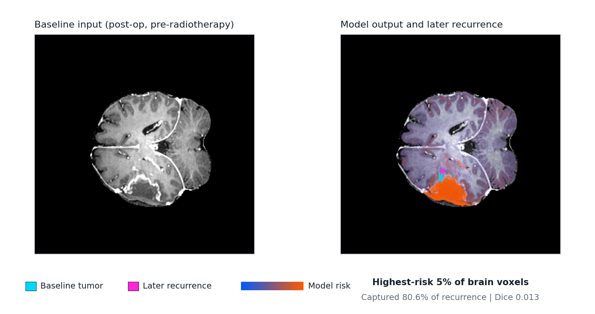
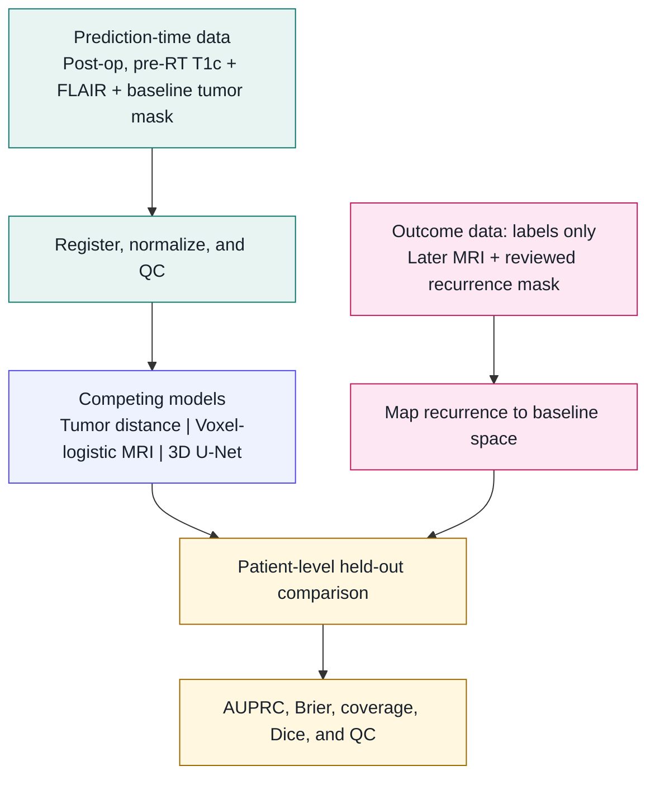

# Voxelwise Glioma Recurrence Modeling from MRI

[](https://www.python.org/)
[](https://docs.astral.sh/uv/)
[](LICENSE)
[](#research-use)
[](https://www.cancerimagingarchive.net/collection/ucsd-ptgbm/)

This retrospective research pipeline uses post-operative, pre-radiotherapy MRI to predict where glioma may later recur. It produces a baseline-space voxelwise risk heatmap, maps reviewed follow-up recurrence labels back to the same space, and writes human-readable QC reports.

## See a real pipeline output

**[Open the real UCSD-PTGBM case](https://danhussey.github.io/brain-cancer-recurrence/examples/ucsd-ptgbm-real-case/)** to inspect preprocessing, the model output, and its overlap with a later reviewed recurrence label. [Jump straight to prediction and label QC](https://danhussey.github.io/brain-cancer-recurrence/examples/ucsd-ptgbm-real-case/public-ucsd-ptgbm-case/qc_overlay.html).



The preview pairs baseline post-operative, pre-radiotherapy T1c with the model risk map and later recurrence label. Cyan marks baseline tumor, magenta marks later recurrence, and blue-to-orange shows model risk. It demonstrates the pipeline output and QC experience; it is not evidence of model performance by itself.

This public example uses a neutral case ID and contains static report assets only. It is research documentation, not a clinical-use output.

## The Experiment

**Question:** Can learned MRI models, from voxelwise logistic regression through an experimental 3D U-Net, localize later recurrence better than a simple distance-from-baseline-tumor model?

**Current answer:** Not yet. On the provisional patient-level UCSD split (37 subjects; 12 held out), the tumor-distance baseline beat the voxel-logistic MRI model on both mean AUPRC and Brier score.

| Held-out mean | Tumor distance | Voxel-logistic MRI |
| --- | ---: | ---: |
| AUPRC (higher is better) | **0.264** | 0.203 |
| Brier score (lower is better) | **0.024** | 0.079 |

The 3D U-Net path is implemented, but it does not yet have a credible held-out result. These numbers are a checkpoint, not a claim of generalization; the next useful result is a leakage-safe comparison across simple and deep models on a larger reviewed cohort. See the [cohort and result note](docs/research-log/2026-05-11-ucsd-cohort-and-labels.md#model-result).



Follow-up scans and recurrence masks define evaluation labels; they are never prediction-time model inputs.

## QC Reports

The reports are static HTML files written beside each case.

`preprocess_qc.html` checks the baseline preparation step: geometry, intensity normalization, heuristic brain mask, baseline tumor-mask placement, and a T1c/FLAIR checkerboard for visual registration QC. It also states current limitations such as proxy skull stripping and no N4 bias correction.

`qc_overlay.html` checks labels and predictions: case summary, tooltip explanations, opacity controls, an axial slice browser, and overlays for baseline tumor, recurrence label, and model risk.

Both slice browsers start at the midline, include jumps to relevant slices, and work directly from the filesystem without a server. The preprocessing checkerboard alternates T1c and FLAIR tiles so discontinuities at tile edges expose possible misalignment.

Reports also write `qc_summary.json`, including recurrence voxels inside and outside the baseline tumor mask when a recurrence label is present. That distinction matters because residual tumor is expected to be high risk; the harder scientific question is whether a model can predict marginal or distant recurrence outside the obvious baseline tumor footprint.

## Run the Experiment

The core install includes the MRI pipeline, NIfTI IO, SimpleITK registration, QC reports, and baseline models. The dev extra installs the test runner.

```sh
uv sync --extra dev
```

Optional MONAI/PyTorch U-Net support is behind the `deep` extra.

```sh
uv sync --extra dev --extra deep
```

Common CLI stages:

```sh
uv run glioma-risk dicom-audit --dicom-root clinical-dicom --output reports/dicom-series.csv --summary-output reports/dicom-summary.json
uv run glioma-risk preprocess --manifest patients.csv --derived-root derived
uv run glioma-risk make-labels --manifest patients.csv --derived-root derived
uv run glioma-risk train --manifest patients.csv --derived-root derived --model tumor-distance --output models/tumor-distance.json
uv run glioma-risk train --manifest patients.csv --derived-root derived --model voxel-logistic-mri --output models/voxel-logistic-mri.json
uv run glioma-risk evaluate --manifest patients.csv --derived-root derived --model-path models/voxel-logistic-mri.json --output reports/eval.json
uv run glioma-risk predict --case-dir derived/P001 --model-path models/voxel-logistic-mri.json --output-dir derived/P001
```

| Model | Role |
| --- | --- |
| `tumor-distance` | Required simple baseline. A learned model should beat this before it is scientifically interesting. |
| `voxel-logistic-mri` | First learned MRI-only baseline using T1c, FLAIR, baseline tumor mask, and distance features. |
| `unet` | Optional MONAI/PyTorch 3D U-Net path when the `deep` extra is installed. |

The default `make-labels` path uses SimpleITK MRI-to-MRI registration. Use `--registration-mode affine` or `--assume-baseline-space` only when the geometry fallback has been checked.

## Medical Data Workflows

The public-data path is MRI-only and uses longitudinal NIfTI images and tumor segmentations. The institutional path starts from clinical DICOM and converts to NIfTI for research processing.

For institutional data, start with a read-only DICOM inventory before conversion:

```sh
uv run glioma-risk dicom-audit \
  --dicom-root /Volumes/External/clinical-dicom \
  --output /Volumes/External/intake/reports/dicom-series.csv \
  --summary-output /Volumes/External/intake/reports/dicom-summary.json
```

The audit reads headers only. It hashes patient keys by default, omits source file paths unless explicitly requested, classifies likely T1/T1c/T2/FLAIR series, summarizes scanner metadata, and flags common PHI-bearing fields.

For UCSD-PTGBM, download images, segmentations, and clinical tables from TCIA onto external storage, then prepare a copied workspace:

```sh
uv run python scripts/prepare_ucsd_ptgbm_dataset.py \
  --source-root /Volumes/External/UCSD-PTGBM \
  --clinical-table /Volumes/External/UCSD-PTGBM/clinical.xlsx \
  --negative-cases-table /Volumes/External/UCSD-PTGBM/details_of_negative_cases_TCIA.xlsx \
  --include-negative-controls \
  --output-root /Volumes/External/UCSD-PTGBM-pipeline
```

The adapter selects subjects with at least two complete MRI+mask timepoints, uses the earliest eligible complete timepoint as baseline, and uses the earliest later residual/recurrent tumor timepoint as the recurrence label. Negative-case tables can keep pseudoprogression, radiation-necrosis, and non-specific later timepoints as controls with empty recurrence labels.

## Development Smoke Test

This synthetic workflow is only for checking installation, command wiring, and report generation. Use reviewed medical data for scientific results.

```sh
git clone https://github.com/danhussey/brain-cancer-recurrence.git
cd brain-cancer-recurrence
uv sync --extra dev

uv run python scripts/generate_synthetic_dataset.py --output-root /tmp/glioma-smoke --n-patients 3 --shape 16,16,16
uv run glioma-risk preprocess --manifest /tmp/glioma-smoke/patients.csv --derived-root /tmp/glioma-smoke/derived
uv run glioma-risk make-labels --manifest /tmp/glioma-smoke/patients.csv --derived-root /tmp/glioma-smoke/derived --assume-baseline-space
uv run glioma-risk train --manifest /tmp/glioma-smoke/patients.csv --derived-root /tmp/glioma-smoke/derived --model tumor-distance --output /tmp/glioma-smoke/models/tumor-distance.json
uv run glioma-risk evaluate --manifest /tmp/glioma-smoke/patients.csv --derived-root /tmp/glioma-smoke/derived --model-path /tmp/glioma-smoke/models/tumor-distance.json --output /tmp/glioma-smoke/reports/eval.json --splits validation,test --write-predictions
uv run glioma-risk predict --case-dir /tmp/glioma-smoke/derived/SYN002 --model-path /tmp/glioma-smoke/models/tumor-distance.json --output-dir /tmp/glioma-smoke/derived/SYN002
```

Open `/tmp/glioma-smoke/derived/SYN002/preprocess_qc.html` to check preprocessing and `/tmp/glioma-smoke/derived/SYN002/qc_overlay.html` to check labels and predictions.

## Research Use

This is a retrospective research and engineering prototype, not a medical device. The risk map is not a clinical dose recommendation, and it should not be used for clinical decision-making, treatment planning, radiotherapy dose design, boost-region selection, or patient management.

The current acceptance bar is intentionally conservative: a learned model should beat the `tumor-distance` baseline under patient-level validation before it is treated as scientifically interesting.

## Reference

### Manifest Columns

Required columns:

| Column | Meaning |
| --- | --- |
| `patient_id` | Patient/case identifier. Splits are enforced at this level. |
| `baseline_scan_date` | Baseline post-op/pre-RT scan date. |
| `baseline_t1c_series_uid` | Baseline T1 post-contrast series UID or NIfTI path in prepared workflows. |
| `baseline_flair_series_uid` | Baseline FLAIR series UID or NIfTI path in prepared workflows. |
| `recurrence_scan_date` | Follow-up scan date used for recurrence label context; the column is required, but values may be empty when unavailable. |
| `recurrence_adjudication` | Clinical recurrence/progression decision. |
| `reviewed_recurrence_mask_path` | Reviewed recurrence mask path, or an empty label path for controls. |
| `split` | `train`, `validation`/`val`, `test`, or `holdout`. |

Recommended optional columns include `reviewed_recurrence_reference_image_path`, `source_dataset`, `baseline_timepoint_id`, `recurrence_timepoint_id`, `radiotherapy_end_date`, `baseline_study_instance_uid`, `baseline_t1_series_uid`, `baseline_t2_series_uid`, `input_format`, `institution_id`, `scanner_manufacturer`, `scanner_model`, `magnetic_field_strength`, and `label_source`.

### Derived Case Files

A fully processed case can use these fixed filenames. Some stages only write the subset they have produced so far.

```text
baseline_t1c.nii.gz
baseline_flair.nii.gz
baseline_tumor_mask.nii.gz
recurrence_mask_on_baseline.nii.gz
brain_mask.nii.gz
recurrence_risk.nii.gz
qc_overlay.html
qc_summary.json
preprocess_qc.html
preprocess_qc_summary.json
```

### Observability Artifacts

Every CLI stage writes structured run artifacts unless `--no-observability` is passed.

| File | Contents |
| --- | --- |
| `events.jsonl` | Timestamped stage, case, metric, and artifact events. |
| `summary.json` | Final status, duration, case statuses, command args, and output artifacts. |

For manifest stages, artifacts default to `DERIVED_ROOT/../observability/RUN_ID/`. For `predict`, they default beside the output directory. For `dicom-audit`, they default under the summary-output directory's parent.

### Development Checks

```sh
uv run --extra dev pytest
uv run --extra dev python scripts/validate_knowledge_store.py
```

## Data Safety

The repository should not contain patient data, clinical spreadsheets, private credentials, or local derived outputs. Keep real datasets on external storage or institution-approved systems. If working data is written inside the repo, note that `.gitignore` currently covers `derived/`, `models/`, and `reports/`, but not sibling directories such as `masks/`, `label_refs/`, or `observability/`.

## Glossary

| Term | Meaning |
| --- | --- |
| Affine | Matrix that maps voxel indices to real patient/world coordinates. |
| AUPRC | Area under the precision-recall curve; useful when recurrence voxels are rare. |
| Baseline / t0 | Earlier post-treatment MRI timepoint used as prediction input. |
| Baseline tumor mask | Tumor segmentation at the baseline timepoint. This is a prediction-time location feature. |
| Brain mask | Binary mask limiting training/evaluation to brain voxels. |
| Brier score | Mean squared error of predicted probabilities; lower is better. |
| Calibration | Whether predicted risks match observed recurrence frequencies. |
| Confirmed recurrence label | Reviewed decision that a later abnormality is true recurrent/progressive tumor plus a voxelwise mask of that tumor. |
| DICOM | Clinical imaging file format used by scanners, PACS, and radiotherapy systems. |
| DICOM SEG | DICOM segmentation object type suitable for future binary or multi-label mask exports. |
| Dice | Spatial overlap score between a predicted region and a label mask. |
| FLAIR | MRI sequence that highlights edema and abnormal fluid-like tissue signal. |
| Follow-up / t1 / t2 | Later imaging timepoints used to determine whether and where recurrence happened. |
| GBM | Glioblastoma, an aggressive glioma. |
| Glioma | Brain tumor type arising from glial cells. |
| Leakage | Accidental sharing of the same patient across train/validation/test. |
| NIfTI | Common research imaging file format, usually `.nii` or `.nii.gz`. |
| Parametric Map | DICOM object type suitable for voxelwise quantitative maps such as future risk-map exports. |
| Pseudoprogression | Early post-radiotherapy imaging change that can mimic recurrence. |
| QC overlay | Visual report showing anatomy, masks, and prediction for human review. |
| Recurrence mask | Human-reviewed mask of where tumor recurrence later occurred, mapped back to baseline space. |
| Registration | Aligning images from different scans into the same coordinate space. |
| Resampling | Regridding one image onto another image's voxel grid after alignment. |
| Risk heatmap | Voxelwise model output from 0 to 1 estimating recurrence risk. |
| Split | Train, validation, or test assignment at the patient level. |
| T1c / T1gd | Contrast-enhanced T1-weighted MRI. This is the main anatomy/tumor channel. |
| Timepoint | One imaging acquisition/session for one subject, often containing several MRI sequences and masks. |
| Voxel | A 3D pixel in an MRI, mask, or risk map. |
